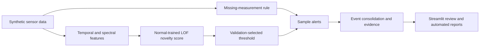
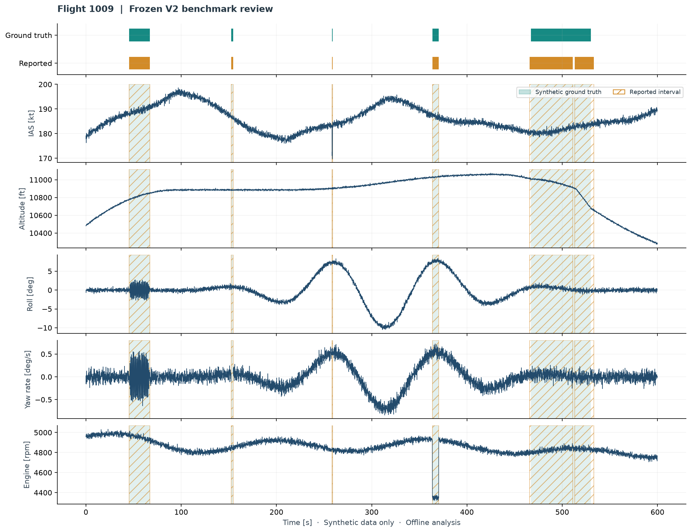
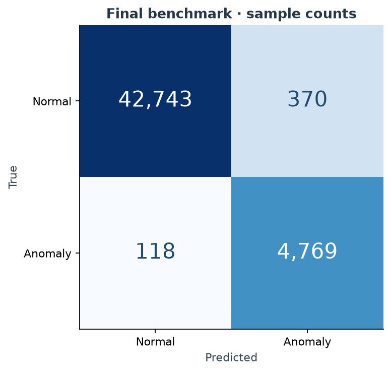
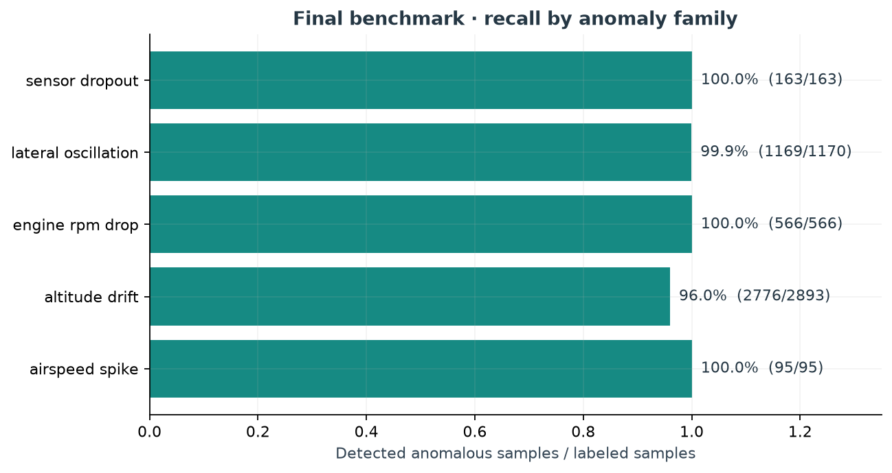
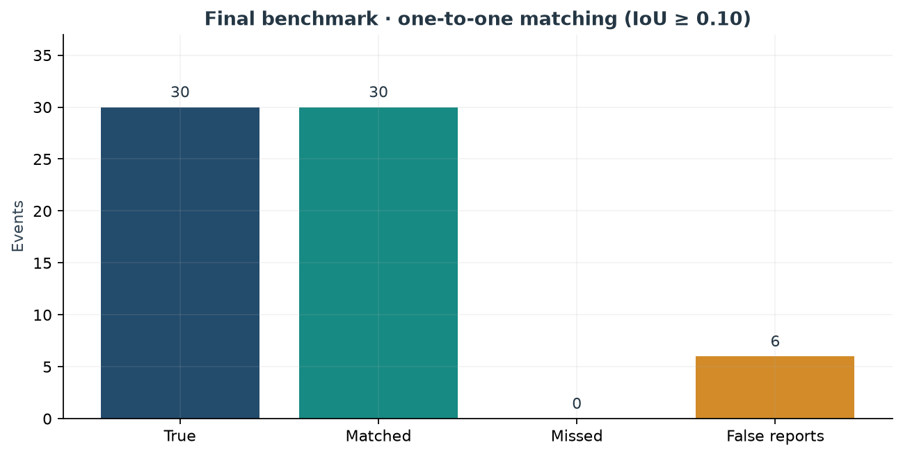
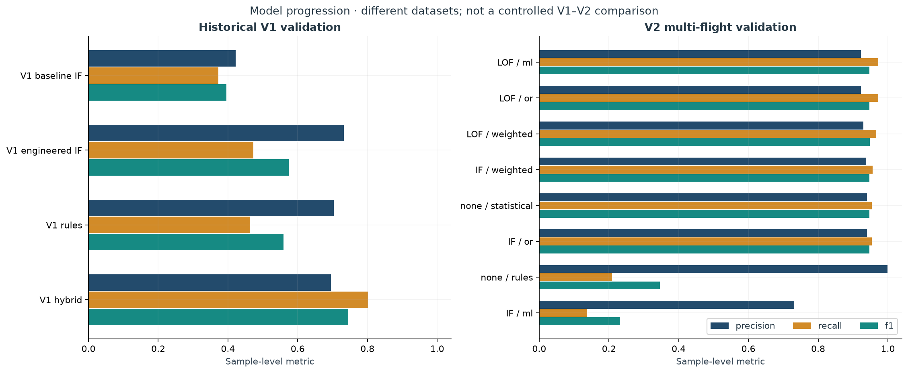

# Flight Test Anomaly Detection System

An offline Python engineering tool for reviewing **synthetic flight-test time series**.
It combines signal processing, machine-learning novelty detection and deterministic
data-quality rules, then turns sample alerts into explainable event reports.

**Frozen V2 benchmark:** precision **0.928**, recall **0.976**, F1 **0.951** across
8 new synthetic flights and 48,000 samples. It matched **30/30 true events**, with
**6 additional false reports** (event precision **0.833**, event F1 **0.909**).
This is not “100% accuracy.”





All data used in this repository are synthetic and are not associated with Airbus,
any real aircraft, or any real flight-test campaign. No operational or safety-critical
validation is claimed. The timeline shows the first predetermined benchmark flight.

## Run it

Tested on Windows with Python **3.13.15**. From the repository root:

```powershell
py -m pip install -r requirements.txt
py main.py
py -m pytest
py -m streamlit run app.py
```

`streamlit run app.py` also works when Streamlit is on PATH. On other systems,
replace `py` with the corresponding Python interpreter.

`requirements.txt` uses the tested direct dependency versions in
`requirements-lock.txt`. Exact benchmark replay requires the numerical environment
recorded in the freeze. Dependencies install from the configured Python package index.
The core analysis takes seconds to a few minutes on a normal laptop; no GPU or
notebook is needed. Generated paths resolve relative to the project, not the shell.

`py main.py --develop` prepares development/validation artifacts without generating
final flights. On the shipped frozen version it reuses the frozen selection.
`py main.py` reconstructs the detector, verifies its fingerprint, regenerates the
same benchmark and checks every input/score/prediction hash against the first receipt.
It **does not run a new model-selection experiment after freeze**.

## Motivation and objectives

Flight-test-style signals contain both legitimate changes in operating condition
and abnormal measurements. A useful review tool should surface relevant episodes,
explain its evidence and make false alerts visible. The project explores those
tradeoffs in an inspectable synthetic environment.

- Compare classical novelty models, statistical evidence and engineering rules.
- Separate normal model fitting, labeled validation and untouched final evaluation.
- Review timestamp classification alongside event coverage and duplicate reports.
- Provide reproducible scripts, tests, interactive plots and CSV/Markdown reports.

## Synthetic dataset

Each V2 flight lasts **600 s at 10 Hz** (6,000 samples, end time excluded). Profiles
include climb, stabilized cruise, gentle manoeuvres, level segments and descent.
Nominal altitude, IAS, RPM, noise, phase timing and injection properties vary by seed.
These are illustrative correlated signals, not a physically validated aircraft model.

Signals: altitude [ft], IAS [kt], roll/pitch [deg], yaw rate [deg/s], normal load
factor [g], engine RPM and an independent vertical-speed measurement [ft/s].
Phase labels and anomaly labels are metadata and never detector features.

| Anomaly | Synthetic behaviour | Main evidence |
| --- | --- | --- |
| Airspeed spike | ±5–24 kt, 0.3–3 s | Residual from a 15 s local median |
| Altitude drift | ±35–150 ft, 30–65 s, gradual ramp/recovery | Altitude trend versus independent vertical speed |
| Lateral oscillation | 0.35–1.35 Hz, 12–28 s; variable roll/yaw amplitude | Band-limited roll/yaw RMS |
| Engine RPM drop | 140–800 rpm, 5–17 s | Residual from a 45 s local median |
| Sensor dropout | 0.5–5 s, IAS/RPM/yaw channel varies | Explicit missingness flag |

Injection order and timing vary; all five families are retained. New seeds test
generalization **within the same generator family**, not arbitrary real-world data.

## Methodology

**Preprocessing and features.** Eight features capture IAS/RPM residuals, cross-sensor
altitude consistency, roll/yaw band RMS, local pitch/load-factor residuals and
missingness. A third-order Butterworth bandpass (0.3–1.8 Hz) followed by a 2 s RMS
window separates oscillatory activity from slow nominal turns. This implementation
uses band energy rather than per-window Welch PSD to keep computation lightweight.

Missingness is recorded before interpolation. Median imputation, robust scaling,
feature reference quantiles and novelty models fit only normal development flights.
Each flight is processed independently; rolling windows never cross flight boundaries.
Centered windows, bidirectional interpolation and zero-phase filtering make this
an **offline/post-flight** detector. It is not causal streaming inference.

**Altitude identifiability.** Altitude alone cannot reliably distinguish a drifting
sensor from a legitimate climb. V2 explicitly assumes an additional noisy, biased
vertical-speed measurement. Its 10 s average is compared with an altitude-derived
rate. This assumption improves observability and is a material change from V1.
Failures affecting both measurements consistently can evade this check.

**Candidates.** Isolation Forest provides a global partition-based novelty baseline;
Local Outlier Factor (LOF, novelty mode, 35 neighbours) measures local density;
a statistical baseline uses the maximum feature/reference-quantile ratio.
Engineering rules cover high local IAS/RPM residuals and missing measurements.
OR and 65/35 statistical/ML score fusion are also evaluated. No deep learning is used.

ML scores are normalized using development medians and 99.5th percentiles. These
are evidence scores, **not calibrated probabilities**. V2 fits on normal data,
then uses validation labels to select thresholds: a semi-supervised evaluation
protocol, not fully unsupervised model selection.

**Selection.** A fixed 32-candidate validation grid maximizes
`0.5 × sample F1 + 0.3 × event F1 + 0.2 × macro anomaly-family recall`.
False-report count breaks objective ties; remaining ties preserve candidate order.
The selected system is **LOF with normalized score >2 plus a missing-data override**.
In experiment tables this is mode `ml`; the mandatory data-quality override is
still active. It is a minimal ML/rule hybrid. More elaborate fusion did not win.

**Events.** Bridge up to 1 s of unflagged time; retain at least 0.5 s of flagged
samples, with an exception for deterministic rule alerts. Raw predictions are not
rewritten. Reports include interval, flagged count, source, signals, rules and scores.
Evidence describes observed behaviour, not a diagnosis of a real aircraft failure.

Evaluation matches events one-to-one with IoU ≥0.10, maximizing eligible match count
and then overlap. Unmatched fragments count as false reports; a merged report can
match only one true event. Half-open intervals include the final sample period.
Signed onset error is reported for temporal alignment, not online detection latency.

## Experimental design and freeze

| Split | Seeds | Role |
| --- | --- | --- |
| Development | 101, 113, 127, 139, 151, 163, 179, 191 | Fit normal-only profiles; anomalous twins for in-sample diagnostics |
| Validation | 307, 311, 331, 347, 359, 373 | Select model/threshold; 373 is normal-only |
| Final V2 | 1009, 1031, 1061, 1091, 1151, 1181, 1213, 1237 | Generated after freeze; last two are normal-only |

The old V1 final flight is historical/development material, never the V2 holdout.
Before generating V2 final data, the pipeline wrote
[freeze_manifest.json](reports/freeze_manifest.json): configuration, seeds, source
hashes, numerical versions and fitted-state fingerprint. The first final evaluation
wrote [benchmark_receipt.json](reports/benchmark_receipt.json). **No detector changes
were made after those results were viewed.** Later runs are exact reproduction checks,
not additional tuning opportunities. Hashes provide local provenance, not an external
cryptographic timestamp or tamper-proof audit service.

Future detector changes require a new version and genuinely new future holdout.
Do not delete the freeze/receipt and present reused benchmark seeds as unseen.

## Results

| Evaluation | Precision | Recall | F1 | Event precision | Event recall |
| --- | ---: | ---: | ---: | ---: | ---: |
| V1 historical final | 0.613 | 0.666 | 0.638 | Original many-to-many protocol | 5/5 |
| V2 validation, 6 flights | 0.923 | 0.972 | 0.947 | 0.862 | 25/25 |
| V2 final, 8 flights | **0.928** | **0.976** | **0.951** | **0.833** | **30/30** |

V1 and V2 use different generators and sensor assumptions; these numbers **do not
establish a controlled head-to-head performance improvement**.

Final sample confusion counts: **TP 4,769 · FP 370 · FN 118 · TN 42,743**.
Final events: **30 true · 36 reported · 30 matched · 0 missed · 6 false reports**.
Five false reports overlap already matched episodes; the remaining report does not.
False-report rate is **4.5 per simulated flight-hour**. Both normal-only controls
have zero flagged samples and zero reported events. Anomaly-bearing flight F1 ranges
from **0.925 to 0.965**. Matched mean IoU is **0.930**.

| Anomaly family | Detected samples | Sample recall |
| --- | ---: | ---: |
| Airspeed spike | 95 / 95 | 100.0% |
| Altitude drift | 2,776 / 2,893 | 96.0% |
| Engine RPM drop | 566 / 566 | 100.0% |
| Lateral oscillation | 1,169 / 1,170 | 99.9% |
| Sensor dropout | 163 / 163 | 100.0% |





Undefined precision/recall/F1 use zero, including alert-free normal-only flights.
Do not interpret their zero F1 as a missed anomaly. Aggregate ratios sum counts
first. Full per-flight results and all reported events are in the generated reports.

## V1 development history and experimental lessons

Recalculated V1 validation F1: baseline IF **0.395** → engineered IF **0.574** →
engineering rules **0.559** → hybrid **0.745**. Its historical final F1 was **0.638**,
showing why independent flights matter. Original final confusion counts were
TP 646, FP 408, FN 324, TN 10,623.

The original V1 reporting protocol found all five true events in eight reports,
with two reports not overlapping any true event. Its many-to-many matching did not
penalize every duplicate. Original output is retained in
[reports/v1/original_run.txt](reports/v1/original_run.txt). V1 event numbers in the
new comparison CSV/dashboard are **reprocessed with V2 consolidation and matching**;
they must not be confused with the original eight-report result.



- V1 temporal features improved validation F1, but altitude-drift recall remained
  weak. More features alone did not resolve generalization.
- V2 weighted LOF fusion at threshold 2 raised sample F1 slightly (0.948 versus
  0.947) but produced five extra event reports rather than four. It lost the
  predeclared combined selection objective.
- LOF OR statistical evidence at threshold 2 tied the selected detector. The
  simpler candidate won the stable tie; no benefit from extra fusion was claimed.
- The V2 statistical baseline at threshold 2 achieved F1 0.947 but lower event F1
  (0.909). Engineering features carry substantial value; ML is not the only source
  of detection performance.
- The remaining final false reports are visible, including split drift episodes.
  Event consolidation was not retuned after seeing them.

See all 32 candidates in [validation_experiments.csv](reports/validation_experiments.csv).

## Dashboard and automated reports

The Streamlit app provides split/flight selection, metric cards, selectable Plotly
signals, zoom/pan, truth/alert overlays, event focus, score evidence, CSV downloads,
model progression and freeze provenance. Ground-truth overlays are optional and
label-based performance is hidden when evaluation mode is disabled.

Main outputs:

- [Technical report](reports/technical_report.md): counts, per-flight metrics, event table and limitations.
- [Final per-flight metrics](reports/final_benchmark_metrics.csv).
- [Final event reports](reports/final_detected_events.csv).
- [All model comparisons](reports/model_comparison.csv).
- [Audit](docs/audit.md) and [methodology](docs/methodology.md).

## Repository structure

```text
app.py                         Streamlit review tool
main.py                        Reproducible pipeline and freeze/replay workflow
src/v2/
  config.py, data.py            Protocol and synthetic generator
  features.py, models.py        Features, fitted references and detectors
  events.py, evaluation.py      Consolidation and metrics
  experiments.py, protocol.py  Selection and provenance
  reporting.py                 Figures and engineering report
src/*.py                       Preserved original V1 modules
archive/v1/main.py              Preserved V1 orchestration (reference copy)
data/*.csv                     Original representative V1 datasets
data/v2/                       Regenerated local CSVs; ignored by Git
reports/                       Compact metrics, freeze/receipt, reports and figures
tests/                         Unit, artifact and dashboard checks
docs/                          Audit, methodology and portfolio material
```

Generated V2 CSVs are deliberately not committed; `py main.py` recreates them.
Original representative V1 data, small reports and README figures remain suitable
for version control. No fitted pickle needs to be downloaded or trusted.

## Limitations and next work

Synthetic data only; simplified dynamics and noise; five nonoverlapping anomaly
families; small number of independent flights; a shared generator across splits;
engineered windows and thresholds; extra reference-sensor assumptions; offline
look-ahead; event boundary/splitting errors; no operational deployment or certification.
No broad claim about real aircraft detection performance is supported.

Next: test public, legally suitable flight datasets; add reference-sensor faults and
common-mode drift; evaluate overlapping anomalies, turbulence and heavier-tailed
noise; quantify uncertainty across more independent flights; compare change-point
methods; redesign causal features and measure latency for streaming operation.
Any model changes need a fresh future holdout.
